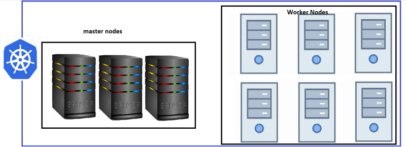
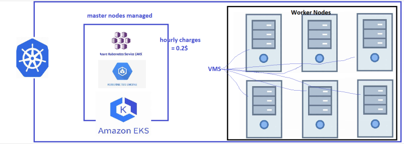
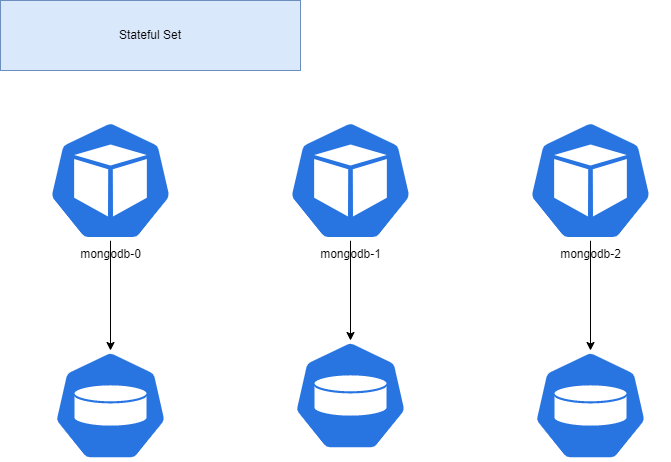

### Kubernetes as a Service (Managed K8s)
* Every Cloud provider offers k8s as a service
    * Azure = AKS
    * AWS = EKS
    * GCP = GKE

* K8s as a service basically means the master nodes will be managed by cloud provider 

* Typical k8s cluster



* K8s as a Service



 * Advantages:
     * less administration
     * nodes can be scaled
     * inbuilt support for cloud integrations

* In this course we will be using
    * EKS
* Setting up basic k8s cluster in AWS (EKS)

* install kubectl [Refer Here](https://kubernetes.io/docs/tasks/tools/)
* Steps to install

```
curl -o kubectl https://amazon-eks.s3.us-west-2.amazonaws.com/1.21.2/2021-07-05/bin/linux/amd64/kubectl
sudo cp kubectl /usr/bin
sudo chmod 755 /usr/bin/kubectl
kubectl version
```

* Install aws cli: [Refer Here](https://docs.aws.amazon.com/cli/latest/userguide/getting-started-install.html)
* Steps to install

```
sudo apt update
sudo apt install unzip -y
curl "https://awscli.amazonaws.com/awscli-exe-linux-x86_64.zip" -o "awscliv2.zip"
unzip awscliv2.zip
sudo ./aws/install
sudo ./aws/install --bin-dir /usr/local/bin --install-dir /usr/local/aws-cli --update
aws --version
```
* Execute ``` aws configure ``` create IAM user for access key & secret key.

* Install eksctl. Steps to install

```
curl --silent --location "https://github.com/weaveworks/eksctl/releases/latest/download/eksctl_$(uname -s)_amd64.tar.gz" | tar xz -C /tmp
sudo mv /tmp/eksctl /usr/local/bin
eksctl version
```

* Create a EKS Cluster using below command 

```
eksctl create cluster --name backup --version 1.22 --nodegroup-name standard-workers --node-type t3.medium --nodes 3 --nodes-min 1 --nodes-max 4
```

* After practice delete the cluster

```
eksctl delete cluster --name backup
```

## StatefulSets
* Statefulset is like deployment with replicas. But each pod gets its own volume.
* Stateful Set is for stateful applications



* When we create replicas in Stateful Set we get predictable names
* [Refer Here](https://kubernetes.io/docs/concepts/workloads/controllers/statefulset/) for official docs
* We can access individual pod, by creating headless service and by using ...svc.cluster.local 
*  Lets experiment with stateful sets and create nginx pods 

```
---
apiVersion: apps/v1
kind: StatefulSet
metadata:
  name: nginx
spec:
  minReadySeconds: 1
  serviceName: nginx-svc
  replicas: 3
  selector:
    matchLabels:
      app: 'nginx'
  template:
    metadata:
      name: nginx
      labels:
        app: 'nginx'
    spec:
      containers:
        - name: nginx
          image: nginx
          ports:
            - containerPort: 80
          volumeMounts:
            - name: htmlhome
              mountPath: /usr/share/nginx/html
  volumeClaimTemplates:
    - metadata:
        name: htmlhome
      spec:
        accessModes: 
          - ReadWriteOnce
        resources:
          requests:
            storage: 1Gi
        storageClassName: managed

---
apiVersion: v1
kind: Service
metadata:
  name: nginx-svc
spec:
  selector:
    app: nginx
  type: ClusterIP
  clusterIP: None
  ports:
    - name: nginx-svc
      port: 80
      targetPort: 80
      protocol: TCP
```

