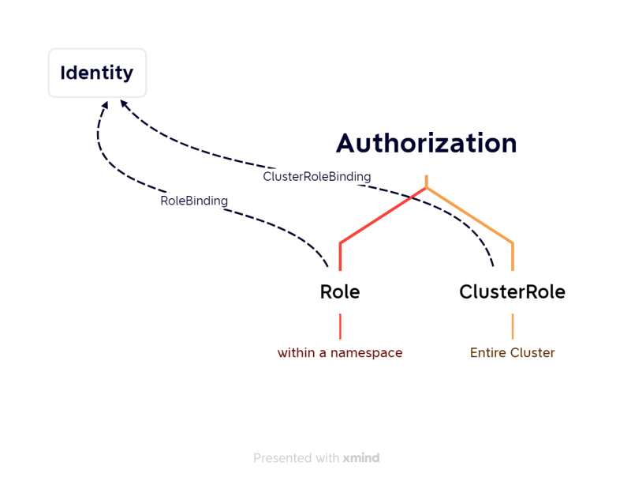
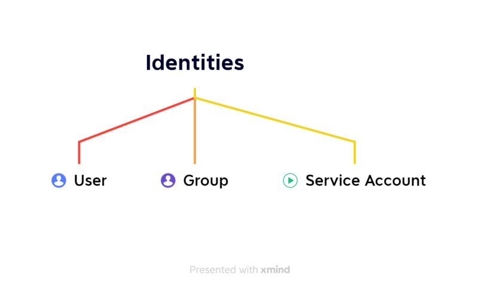

### Horizontal Pod Autoscaler
* This allows to autoscale pods based on metrics
* [Refer Here](https://kubernetes.io/docs/tasks/run-application/horizontal-pod-autoscale/) for official docs
* Checkout the below manifest files
* Nginx deployment file

```yml
---
apiVersion: apps/v1
kind: Deployment
metadata:
  name: nginx-deploy
spec:
  minReadySeconds: 10
  replicas: 2
  selector:
    matchLabels:
      app: nginx
  strategy:
    type: RollingUpdate
    rollingUpdate:
      maxSurge: 25%
      maxUnavailable: 25%
  template:
    metadata:
      name: nginx-pod
      labels:
        app: nginx
        version: "2.60.3"
    spec:
      containers:
        - name: nginx
          image: nginx
          ports:
            - containerPort: 80
              protocol: TCP
          readinessProbe:
            httpGet:
              path: /
              port: 80
          livenessProbe:
            tcpSocket:
              port: 80
---
apiVersion: v1
kind: Service
metadata:
  name: nginx-svc-lb
spec:
  type: LoadBalancer
  selector:
    app: nginx
  ports:
    - name: webport
      port: 35000
      targetPort: 80
```

* HPA manifest file

```yml
---
apiVersion: autoscaling/v2
kind: HorizontalPodAutoscaler
metadata:
  name: nginx-hpa
spec:
  maxReplicas: 10
  minReplicas: 2
  metrics:
    - type: Resource
      resource:
        name: cpu
        target:
          averageUtilization: 70
          type: Utilization
  scaleTargetRef:
    apiVersion: apps/v1
    kind: Deployment
    name: nginx-deploy
```

## RBAC
* Authorization in K8s [Refer Here](https://kubernetes.io/docs/reference/access-authn-authz/rbac/)



* Authentication in k8s [Refer Here](https://kubernetes.io/docs/reference/access-authn-authz/authentication/)



* Attaching Authorization to identity using Bindings
   * RoleBinding
   * ClusterRoleBinding
* [Refer Here](https://www.adaltas.com/en/2019/08/07/users-rbac-kubernetes/) for creating users and setting permissions
