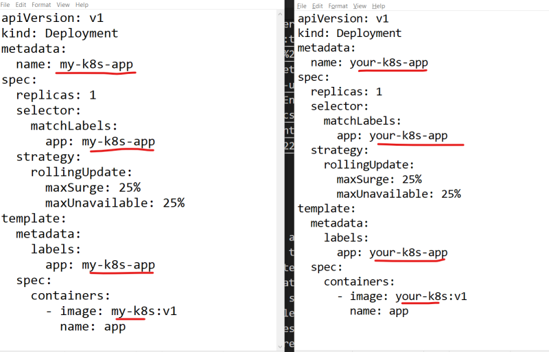

## HELM
* In order to deploy an application on k8s we need to interact with k8s API to create resources, kubectl is the tool we use to do this
* We express Kubernetes resources in YAML Files
* These files are static in nature.
* Resource files are static:

    * This is the challenge that primarily effects the declarative configuration style of applying YAML resources
    * K8s YAML files are not designed to be parametarized
    * Consider the below two manifests writtent to deploy two different applications 

    

    * In the above image each file is almost exactly the same, but we still cannot parametrize

* Helm to the rescue: Helm is an opensource tool used for packaging and deploying applications on k8s. It is often referred as Kubernetes Package Manager.
* Helm was designed to provide an experience similar to that of package manager (apt, yum, dnf etc)
* APT operates on debian packages and yum/dnf operates on RPM package.
* Helm operates on Charts.
* A Helm Chart contains declarative k8s resource files required to deploy an application
* Helm relies on repositories to provide access to charts
* Chart developers create declarative YAML files , package them into charts and publish them to chart repository
* End users then Helm to search for existing chart to deploy some app on to k8s
* [Refer Here](https://bitnami.com/stack/mysql/helm) to view a sample usage of helm chart which installs mysql.
* Lets try to understand Helm’s subcommands

| DNF Subcommands | Helm Subcommands | Purpose |
|  ---------------| -----------------| ------- |
| install | install | install an application and its dependencies |
| upgrade | upgrade | upgrades an application to newer version |
| downgrade | rollback | reverts the application to previous version |
| remove | uninstall |delete an application |

* The abstracted complexity of k8s resources:

    * Let’s assume a developer has been given a task of deploying a Mysql database onto k8s.
    * Developer needs to create resources required to create containers, network and storage
    * With Helm, developer tasked with deploying a mysql database could simply search for MySQL Chart in chart repositories

* Automated Life cycle Hooks: 
    * Helm provides the ability to define the life cylce hooks. Lifecycle hooks are actions that take place automatically at different stages of an application’s life cycle.
    * Examples:
        * Perform a data backup on an upgrade
        * Restore data on rollback
        * Validate k8s environment prior to installation

## Helm Installation
* [Refer Here](https://helm.sh/docs/intro/install/) for steps

## Configuring Helm
* Helm is a tool with sensible default settings that allow users to be productive without needing to perform a large of post-installation tasks

* With that being said there are several options users can change or enable to modify the Helm’s behavior.

* Adding upstream repositories:
   * Helm provides the repo subcommand to allow users to manage configured chart repositories. This subcommand contains additional subcommands 
     *  add: To add a chart repository
     * list: To list chart repositories
     * remove: To remove the chart repository
     * update: To update information on available charts locally from chart repositories
    * index: To generate and index file given a directory containing packaged charts

* Example: Lets install mysql from bitnami repository [Refer Here](https://bitnami.com/stacks/helm)
   * Add bitnami repository as upstream 
       ```
       helm repo add bitnami https://charts.bitnami.com/bitnami

       helm repo list
       ```
   * Install mysql

     ```
     helm install my-release bitnami/mysql
     ```
   * To uninstall mysql
   ``` helm uninstall my-release ```
   * For managing plugins, helm has a subcommand ``` plugin ```
   ``` helm plugin ```
   * [Refer Here](https://helm.sh/docs/community/related/) for some plugins


* ENVIRONMENT Variables: Helm relies on the existense of externalized environmental variables to configure low-level options

    * XDG_CACHE_HOME: Sets an alternative location for storing cached files
    * XDG_CONFIG_HOME: Sets an alternative location for storing helm configuration
    * XDG_DATA_HOME: Sets an alternative location for storing Helm Data
    * HELM_DRIVER: Sets the backend storage driver
    * HELM_NO_PLUGINS: Disables the plugins
    * KUBECONFIG: Sets an alternative Kubernetes configuration file
    * [Refer Here](https://helm.sh/docs/helm/helm/) for official docs

* Helm has the following paths

   * Windows:
        * Cache Path: %TEMP%\helm
        * Configuration Path: %APPDATA%\helm
        * Data Path: %APPDATA%\helm
   * Linux:
        * Cache Path: $HOME/.cache/helm
        * Configuration Path: $HOME/.config/helm
        * Data Path: $HOME/.local/share/helm
   * Mac:
        * Cache Path: $HOME/Libarary/Caches/helm
        * Configuration Path: $HOME/Library/Preferences/helm
        * Data Path: $HOME/Library/helm


