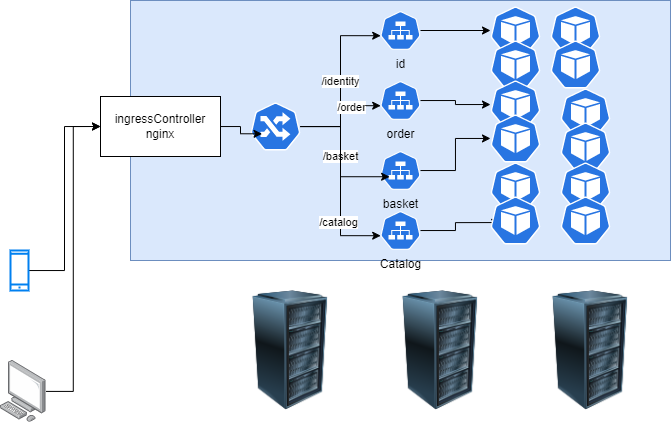
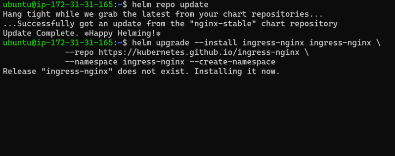
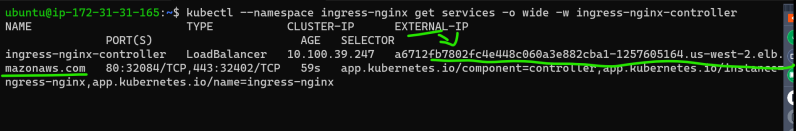
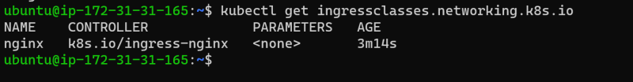
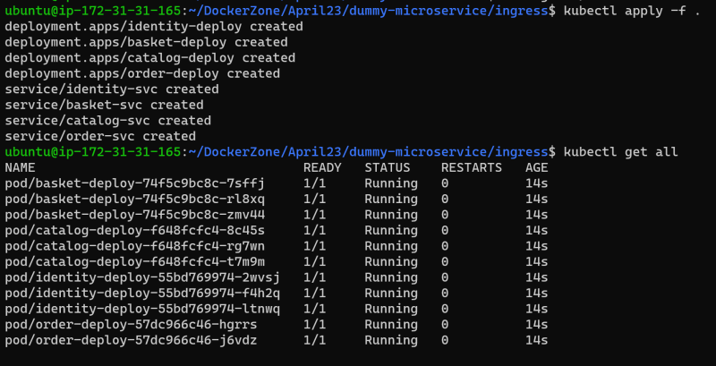
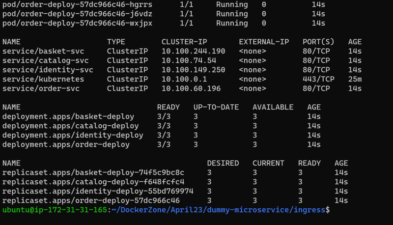
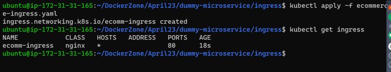
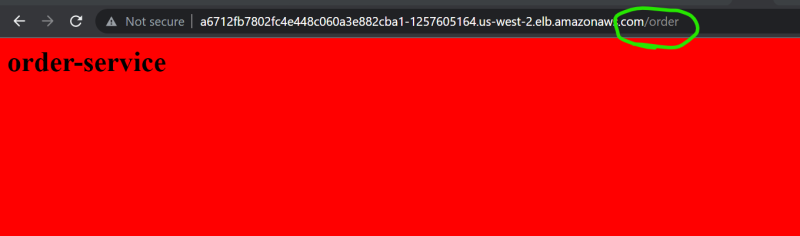
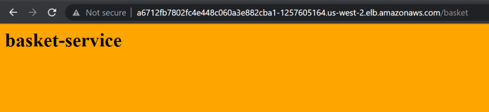

### Kubernetes Installation Steps
* First Install Docker
* Execute the below commands

```
# execute as a root user (install on both master $ nodes)
curl -fsSL https://get.docker.com -o install-docker.sh
sh install-docker.sh
docker usermod -aG docker ubuntu
# exit & re-login
```
* Now Intall k8s using below shell script in master and nodes

```sh
#!/bin/bash
sudo apt-get update
sudo apt-get install -y apt-transport-https ca-certificates curl
sudo curl -s https://packages.cloud.google.com/apt/doc/apt-key.gpg | apt-key add -
#sudo curl -fsSLo /usr/share/keyrings/kubernetes-archive-keyring.gpg https://packages.cloud.google.com/apt/doc/apt-key.gpg
#echo "deb [signed-by=/usr/share/keyrings/kubernetes-archive-keyring.gpg] https://apt.kubernetes.io/ kubernetes-xenial main" | sudo tee /etc/apt/sources.list.d/kubernetes.list
cat <<EOF >/etc/apt/sources.list.d/kubernetes.list

deb http://apt.kubernetes.io/ kubernetes-xenial main

EOF
sudo apt-get update
#sudo apt install -y kubeadm=1.18.13-00 kubelet=1.18.13-00 kubectl=1.18.13-00
sudo apt install -y kubeadm=1.20.0-00 kubelet=1.20.0-00 kubectl=1.20.0-00
sudo apt-mark hold kubelet kubeadm kubectl
rm /etc/containerd/config.toml
systemctl restart containerd
```
* initialize the kubernetes(root user)
```
kubeadm init
```
* * After installing k8s execute below comand as a normal user
```

  mkdir -p $HOME/.kube
  sudo cp -i /etc/kubernetes/admin.conf $HOME/.kube/config
  sudo chown $(id -u):$(id -g) $HOME/.kube/config
```
* To establish a network apply weavenet

```
kubectl apply -f https://github.com/weaveworks/weave/releases/download/v2.8.1/weave-daemonset-k8s.yaml
```
* We will get a token use that token to add servers as a node to master
## Ingress
* To understand concept of ingress [Refer Here](https://doc.traefik.io/traefik/getting-started/concepts/)
* In k8s we have 3 major objects which will help in ingress (layer 7 loadbalancing) 
     * ingress
     * ingressController: This is a third party implementation [Refer Here](https://kubernetes.io/docs/concepts/services-networking/ingress-controllers/)
     * ingressClass
* K8s doesnot have controller for ingress.
* Lets create four simple applicatons [Refer Here](https://github.com/devops-easy/Kubernetes/tree/master/k8s%20Files/Day15/microservices) for changes done
* Create docker image and push them to registry
* For this classroom purpose i will be using nginx-ingress-controller [Refer Here](https://www.nginx.com/products/nginx-ingress-controller/)
* Our implementation:



* lets install nginx-ingress controller using helm

```
helm repo add nginx-stable https://helm.nginx.com/stable
helm repo update
helm upgrade --install ingress-nginx ingress-nginx \
             --repo https://kubernetes.github.io/ingress-nginx \
             --namespace ingress-nginx --create-namespace
```


* After last command we see output which better copy to some notepad
* Now execute the following command to watch for external ip to nginx ingress controller
```
 kubectl --namespace ingress-nginx get services -o wide -w ingress-nginx-controller

```



* Get ingress classes and there should be nginx ingress class from helm chart



* ets deploy application and services. [Refer Here](https://github.com/devops-easy/Kubernetes/tree/master/k8s%20Files/Day15/ingress) for the changes







*  [Refer Here](https://github.com/devops-easy/Kubernetes/tree/master/k8s%20Files/Day15/ingress) for the manifest file for ingress
* Now create ingress object



* Get external ip of ingress controller using ``` kubectl --namespace ingress-nginx get services -o wide -w ingress-nginx-controller ```





* [Refer Here](https://kubernetes.io/docs/concepts/services-networking/ingress/) for official docs of ingress
