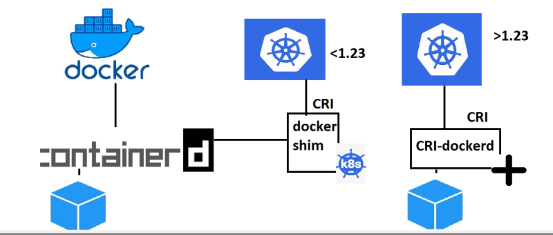
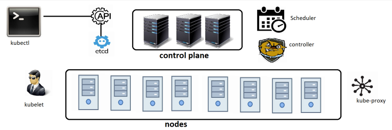
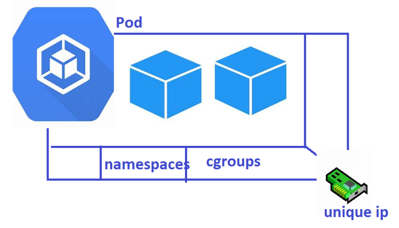
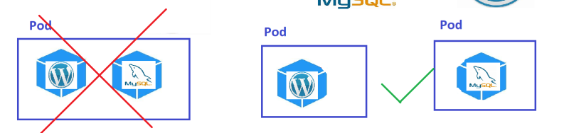
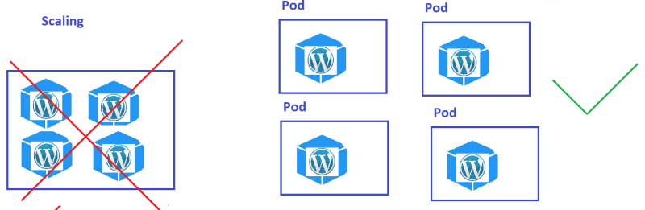
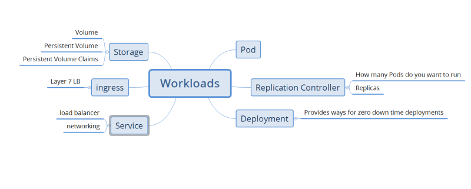

### K8s Installations
* Single Node Installations
    * minikube
    * kind
* On-prem installations
     * kube-admin
* k8s as a Service
    * AKS
    * EKS
    * GKE
* Playground (for learning): [Refer Here](https://labs.play-with-k8s.com/)

## Installing k8s cluster on ubuntu vms
* Create 3 ubuntu vms which are accesible to each other with atlest 2 vCPUS and 4 GB RAM
* Installation method (kubeadm) which is something we will be using in on-premises k8s.
* [Refer Here](https://kubernetes.io/docs/setup/production-environment/tools/kubeadm/install-kubeadm/) for kubeadm installation on single master node

## Steps
* Install docker on all servers
* Use below script to install

```shell
#!/bin/bash
curl -fsSL https://get.docker.com -o get-docker.sh
sh get-docker.sh
sudo usermod -aG docker ubuntu
```
* Install kubectl,kubadm,kubelet in all servers
* Use below script to install

```shell
#!/bin/bash
sudo apt-get update
sudo apt-get install -y apt-transport-https ca-certificates curl
sudo curl -fsSLo /usr/share/keyrings/kubernetes-archive-keyring.gpg https://packages.cloud.google.com/apt/doc/apt-key.gpg
echo "deb [signed-by=/usr/share/keyrings/kubernetes-archive-keyring.gpg] https://apt.kubernetes.io/ kubernetes-xenial main" | sudo tee /etc/apt/sources.list.d/kubernetes.list
sudo apt-get update
sudo apt install -y kubeadm=1.18.13-00 kubelet=1.18.13-00 kubectl=1.18.13-00
sudo apt-mark hold kubelet kubeadm kubectl
sudo rm /etc/containerd/config.toml
sudo systemctl restart containerd
## chmod +x k8s.sh | ./k8s.sh
```

* AS a root user run ``` kubeadm init ``` in ``` Master ```
* After that run ``` kubeadm join ``` in ``` Node ```
* Now from manager execute ``` kubectl get nodes ```

## CNI – Container Network Interface
* Docker containers for networking have a Standard CNM (Container Network Model)
* CNI (Container Network Interface) is another standard which also speaks about networking to container run times [Refer Here](https://github.com/containernetworking/cni)
* CNI Plugins implement networking functionalities. In the case of k8s Networking is implemented by CNI and we have an option to choose the CNI Plugin in bare metal installations.
* CNI Plugins help kube-proxy to give a unique ip address to every Pod in the k8s cluster.
* Some of the popular CNI Plugins
    * Weave Net
    * Flannel
    * Calico

## Self Hosted K8s
* Problem with k8s version from 1.23



* K8s installations will not have default CNI. So post installtion of k8s cluster we need to install any CNI implementation which works for us
* kubelet on the node creates the container inside the Pod by using container runtime (Docker/CRI-o).
* Each Pod requires a network connection which is provided by kube-proxy which requires CNI to assist.



##  Installation Steps Reference

* Create some nodes (>1)
* Install docker on each node
* Install kubeadm on each node
* Make one node master/control plane
* Add other nodes to the cluster
* Install any CNI implementation (Weavenet)

```
kubectl apply -f https://github.com/weaveworks/weave/releases/download/v2.8.1/weave-daemonset-k8s.yaml
```
## Lets verify the Resources
* To view the api-resources

```
kubectl api-resources
```
* The above api resources can be interacted from kubectl

```
kubectl get nodes
kubectl get no
kubectl get no -o wide
```
## Kubernetes Workloads
* Pod:
   * This is smallest unit of creation in k8s cluster
   * Pods have container(s)
   * Each Pod in k8s cluster gets a unique ip address
   * All the containers in the Pod share the same network namespace.


   

   

   

   

## Kubernetes api versioning

* To k8s cluster we directly or indirectly using kubectl speak with API Server
* k8s has lot of features underdevelopment, stable, improvements
* There are 3 channels for objects/features
    * alpha
    * beta
    * stable
* To fill apiVersion the syntax ``` <api-group>/<version> ```
* API Group is group of similar k8s objects
* If the api group is Core then ``` apiVersion: <version> ```

## Kubernetes Objects
* Every thing in k8s is an object.
* To declare an object, we need to specify 4 fields

```
apiVersion: 
kind: 
metadata:
spec:
```
* K8s cluster will create and object and add an extra field called as status

```
apiVersion: 
kind: 
metadata:
spec:
status:
```

* kind is type of object
* metadata describes some additional information about object you are trying to create (name, labels)
* spec: This is the desired state
* To get all the api-resources in your k8s cluster

```
kubectl api-resources
```
## Imperative Way to manage k8s objects
* [Refer Here](https://kubernetes.io/docs/tasks/manage-kubernetes-objects/imperative-command/) for official docs

```
kubectl run nginx-pod --image nginx
kubectl get po
kubectl get pods nginx-pod -o yaml
```
## Pod lifecycle
* K8s Pods will have following states
    * Pending
    * Running
    * Succeded
    * Failed
    * Unknown
* Pod life cycle [Refer Here](https://kubernetes.io/docs/concepts/workloads/pods/pod-lifecycle/)
* Pod Phases [Refer Here](https://kubernetes.io/docs/concepts/workloads/pods/pod-lifecycle/#pod-phase)
* Pod restart policy: Always, Never, OnFailure 

## Container States in k8s pod
* Waiting
* Running
* Terminated
* [Refer Here](https://kubernetes.io/docs/concepts/workloads/pods/pod-lifecycle/#container-states) for container states
* IN pods we can specify container restart policy [Refer Here](https://kubernetes.io/docs/concepts/workloads/pods/pod-lifecycle/#restart-policy)

## Writing K8s Manifests
* The only workload which we know is Pod.
* Pod has container(s)
* [Refer Here](https://kubernetes.io/docs/reference/) for kubernetes api reference
* K8s 1.25 api reference [Refer Here](https://kubernetes.io/docs/reference/generated/kubernetes-api/v1.25/)
* Since we are working with Pod [Refer Here](https://kubernetes.io/docs/reference/generated/kubernetes-api/v1.25/#pod-v1-core)
* Api Version: ``` <group>/<version> ```
* Kind: Ensure you follow casing 

## Activity 1 : Let me write a simple pod with one nginx container

```yaml
---
apiVersion: v1
kind: Pod
metadata:
  name: hello-pod
spec:
  containers:
    - image: nginx:1.23
      name: nginx-container
      ports:
        - containerPort: 80
```

## Activity 2: Lets write a simple pod spec/manifest to run jenkins as well as nginx containers in one pod

```yaml
---
apiVersion: v1
kind: Pod
metadata:
  name: second-pod
spec:
  containers:
    - image: nginx:1.23
      name: nginx
      ports: 
        - containerPort: 80
          protocol: TCP
    - image: jenkins/jenkins:lts-jdk11
      name: jenkins
      ports:
        - containerPort: 8080
          protocol: TCP
```
## Activity 3: Write a k8s pod manifest to run one container with alpine with cmd sleep 1d (docker container run -d alpine sleep 1d)

```yaml
apiVersion: v1
kind: Pod
metadata:
  name: alpine
  namespace: default
spec:
  containers:
  - name: alpine
    image: alpine
    command:
      - sleep
      - "3600"
    imagePullPolicy: IfNotPresent
  restartPolicy: Always
```
* Lets run some basic commands

```
kubectl get pods -o wide
kubectl describe pods hello-pod
```
* Run the following command ``` kubectl get pods hello-pod -o yaml ```
* Lets delete the pod

```
kubectl delete -f <filename>
```


