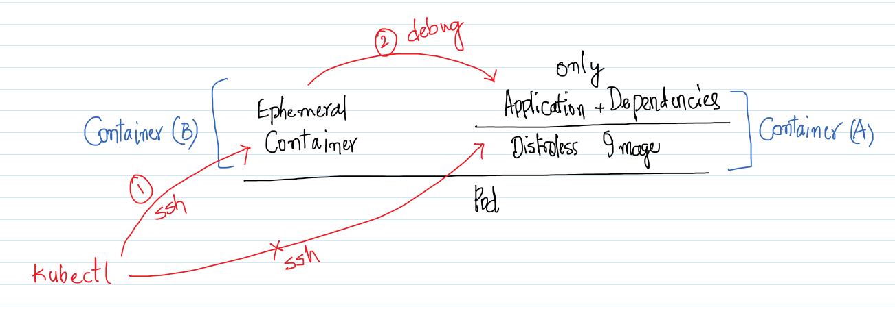
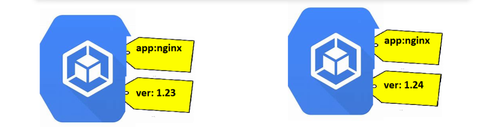

### Pods can run 3 types of containers
* Containers => Where we run our applications
* init containers:
    * These containers are created one by one and only after its completion, the normal containers are created.
        We will use these containers for any initial setup or configuration kind of purposes
* ephemeral containers:
    * No guarantee containers, they are used rarely in the case of debugging or trouble shooting containers in Pod



* Lets create a Pod with 2 init container which sleep for 5 seconds and then in container we run nginx. 

```yml
---
apiVersion: v1
kind: Pod
metadata:
  name: init-demo
spec:
  initContainers:
    - name: init-cont1
      image: alpine:3
      command:
        - sleep
        - "30"
    - name: init-cont2
      image: alpine:3
      command:
        - sleep
        - "30"
  containers:
    - name: nginx
      image: nginx:1.23
      ports:
        - containerPort: 80
          protocol: TCP
```
* Writing YAML files to describe the status is referred as declarative approach, k8s also supports imperative approach 

```
kubectl run nginx --image=nginx --restart=Never
```

* [Refer Here](https://kubernetes.io/docs/reference/generated/kubectl/kubectl-commands#run) for some example imperative commands

## Labels in K8s
* [Refer Here](https://kubernetes.io/docs/concepts/overview/working-with-objects/labels/) for official docs
* In k8s as part of metadata we can apply labels to the resources.
* These labels help in querying resources based on conditions according labels defined
* Labels are key value pairs that can be attached as metadata to k8s objects.
* Labels help in selecting/querying/filtering objects
* Labels can be selected using 
    * equality based [Refer Here](https://kubernetes.io/docs/concepts/overview/working-with-objects/labels/#equality-based-requirement)
    * set based [Refer Here](https://kubernetes.io/docs/concepts/overview/working-with-objects/labels/#set-based-requirement)



* Lets create 2 pod specs with label specifications as shown above

```yml
---
apiVersion: v1
kind: Pod
metadata:
  name: nginx1
  labels:
    app: nginx
    ver: "1.23"
spec:
  containers:
    - image: nginx:1.23
      name: nginx
      ports: 
        - containerPort: 80
          protocol: TCP
---
apiVersion: v1
kind: Pod
metadata:
  name: nginx2
  labels:
    app: nginx
    ver: "1.24"
spec:
  containers:
    - image: nginx:1
      name: nginx
      ports: 
        - containerPort: 80
          protocol: TCP
```
* Now execute the below commands

```
kubectl apply -f nginx-label.yml
kubectl get po -o wide
kubectl describe pod nginx1
kubectl describe pod nginx2
kubectl get po --show-labels
kubectl get po --selector "app=nginx"
kubectl get po --selector "app!=nginx"
```
* Lets run some command line selectors

```
kubectl get po
kubectl get po -l app=nginx
kubectl get po -l ver=1.23
kubectl get po -l 'ver notin (1)'
kubectl get po -l 'vet in (1)'
kubectl get po -l 'ver in (1), app in (apache)'
kubectl get po -l 'ver in (1.23,1.24), app in (apache,nginx)'
```
* Lets run a alpine pod

```yml
---
apiVersion: v1
kind: Pod
metadata:
  name: alpine
spec:
  containers:
    - name: alpine
      image: alpine
      args:
        - sleep
        - 1d

```
* Now if we want to execute a command in the container of alpine pod

```
kubectl exec alpine -- pwd
kubectl exec alpine -- ls
```
* To access the terminal

```
kubectl exec alpine -it -- /bin/sh
```
* Exercise: If we have a pod with 2 container how exec a command on a specific container

```
kubectl exec -it 
```
* Lets run a pod which run application(httpd) on some port
* Now if we want to access the application in container we can do port-forward (not recommended approach)

```
kubecl port-forward --address "0.0.0.0" httpd-pod 8080:80
```

## Controllers in K8s


* Controllers are k8s objects which run other k8s resources. This k8s resource will be part of specification generally in template section.
* Controllers maintain desired state.
* Some of the controllers are
    * Replication Controller/Replica Set
    * Stateful Sets
    * Deployments
    * Jobs
    * Cron Jobs
    * Daemonset
