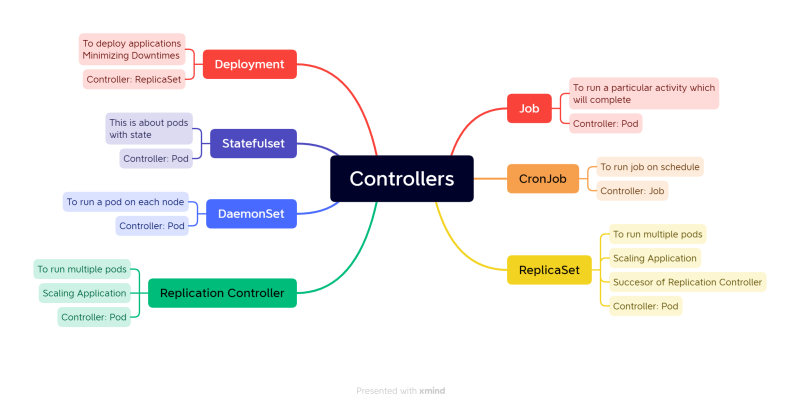

## Controllers in K8s



* Controllers are k8s objects which run other k8s resources. This k8s resource will be part of specification generally in template section.
* Controllers maintain desired state.
* Some of the controllers are
    * Replication Controller/Replica Set
    * Stateful Sets
    * Deployments
    * Jobs
    * Cron Jobs
    * Daemonset


### K8s Jobs
* [Refer Here](https://kubernetes.io/docs/concepts/workloads/controllers/job/) for official docs
* K8s has two types of jobs
    * Job: Run an activity/script to completion
    * CronJob: Run an activity/script to completion at specific time period or intervals.
    * Job manifest file

    ```yml
    ---
    apiVersion: batch/v1
    kind: Job
    metadata:
      name: hellojob
    spec:
     backoffLimit: 5
     template:
       metadata:
         name: jobpod
       spec:
         restartPolicy: OnFailure
         containers:
           - name: alpine
             image: alpine
             command:
               - sleep
               - 10s
    ```
    * CronJob manifest file

    ```yml
    ---
    apiVersion: batch/v1
    kind: CronJob
    metadata:
      name: periodicjob
    spec:
      schedule: '* * * * *' 
      jobTemplate:
        metadata:
          name: getlivedata
        spec:
          backoffLimit: 2
          template:
            metadata:
              name: livedatapod
            spec:
              restartPolicy: OnFailure
              containers:
                - name: alpine
                  image: alpine
                  command:
                    - sleep
                    - 3s
    ```
    * For jobs restartPolicy cannot be Always as job will never finish
    * Jobs have backoffLimit to limit number of restarts and activeDeadline seconds to limit timeperiod of execution.
    * Running job and waiting for completion
    * Cronjob manifest which we have written create a job every minute and waits for completion