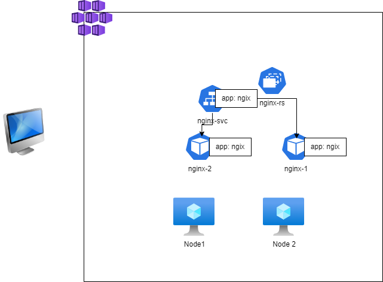
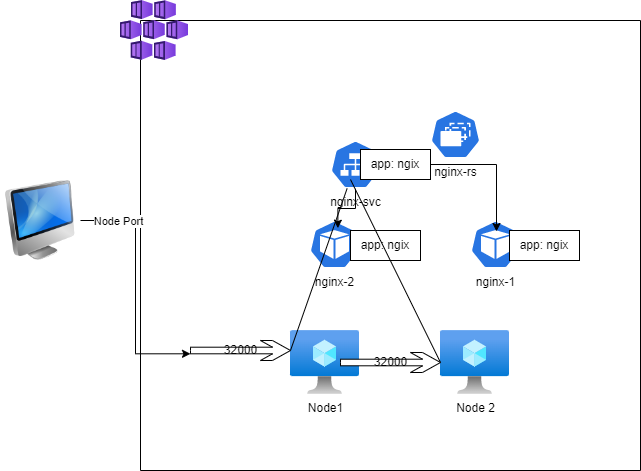
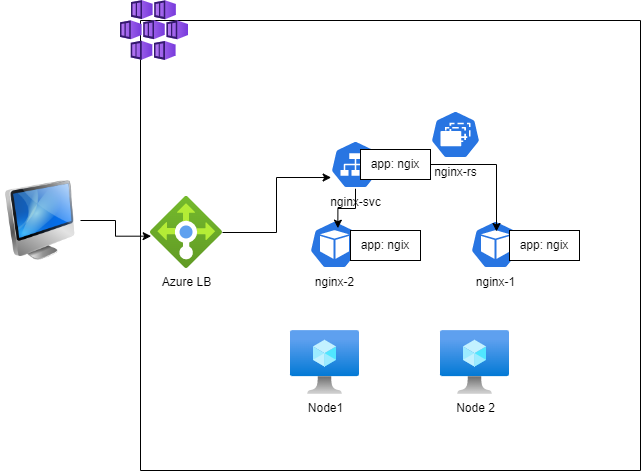

### Exposing Applications running in cluster to externally as well as internally when scaled (Kubernetes Services)

* Every pod gets a unique ip and name.
* Connecting from one pod to other on the basis of name/ip might not be a good idea as pods are controlled by replicasets or other controllers
* K8s has a service which helps us in connecting to pods with similar behaviour but by using labels.
* Each service gets a ip address and this is virtual ip which helps in forwarding traffic to one of the pod based on labels. This ip is called as cluster ip
* Services can be exposed to external world
* Service is similar to layer 4 load balancer [Refer Here](https://kubernetes.io/docs/concepts/services-networking/service/)


* [Refer Here](https://kubernetes.io/docs/tutorials/kubernetes-basics/expose/expose-intro/) for official docs

### External Communication using k8s service
* Some user external to k8s cluster wants to access nginx



* Kubernetes has the service publishing types [Refer Here](https://kubernetes.io/docs/concepts/services-networking/service/#publishing-services-service-types) 
   * Cluster ip: internal communication
   * Node Port: k8s will expose the application on a port on every node in k8s cluster.

   

   * LoadBalancer: This is generally used with managed k8s clusters

   

   * ExternalName: Creates a CNAME record that can be used in your DNS Servers

* We have created a manifest with loadBalancer

```yml
---
apiVersion: apps/v1
kind: Deployment
metadata:
  name: nginx-deploy
spec:
  minReadySeconds: 1
  replicas: 3
  selector:
    matchLabels:
      app: nginx
  strategy:
    type: RollingUpdate
    rollingUpdate:
      maxSurge: 25%
      maxUnavailable: 25%
  template:
    metadata:
      name: nginx
      labels:
        app: nginx
        ver: "1.23"
    spec:
      containers:
        - name: nginx
          image: nginx
          ports:
            - containerPort: 80

---
apiVersion: v1
kind: Service
metadata:
  name: nginx-svc
spec:
  selector:
    app: nginx
  ports:
    - name: nginx-svc
      port: 80
      targetPort: 80
      protocol: TCP
  type: LoadBalancer
```

* When upgrading to newer versions of Pods ensure right set of labels are present on k8s service selector


### Storage Solutions in K8s

* Stateful applications store data locally. In Containers the data created locally will be lost once you delete it. So to solve this in docker we have used volumes. Volumes have a lifecycle which has no relation to container lifecycle (refer docker containers, image layers, volumes)
* IN k8s we are running docker containers, k8s is an orchestration solutions.
* Lets see what are options for storage provisioning in k8s [Refer Here](https://kubernetes.io/docs/concepts/storage/)
*  The most widely used storage types
     * Volumes
     * Persistent Volumes
     * Storage Classes
     * Persistent Volume Claims
* Volumes [Refer Here](https://kubernetes.io/docs/concepts/storage/volumes/)

## Volumes
* Volumes can be mounted to containers and they have lifetime equivalent to Pods.
* The types of Volumes [Refer Here](https://kubernetes.io/docs/concepts/storage/volumes/#volume-types)
* The types
   * storage on cloud
        * ebs
        * azure disk
        * efs
        * azure file
        * gcs
    * empty dir
    * hostPath

* Lets create a manifest with mysql-pod with volume emptydir type

```yml
---
apiVersion: v1
kind: Pod
metadata:
  name: mysql-vol
  labels:
    app: mysql
    layer: db
spec:
  containers:
    - name: mysql
      image: mysql:8
      ports:
        - containerPort: 3306
      volumeMounts:
        - name: test-volume
          mountPath: /var/lib/mysql
  volumes:
    - name: test-volume
      emptyDir:
        sizeLimit: 100Mi
```

 * Lets create a manifest with mysql-pod with volume hostpath type

 ```yml
 ---
apiVersion: v1
kind: Pod
metadata:
  name: mysql-vol
  labels:
    app: mysql
    layer: db
spec:
  containers:
    - name: mysql
      image: mysql:8
      ports:
        - containerPort: 3306
      volumeMounts:
        - name: test-volume
          mountPath: /var/lib/mysql
  volumes:
    - name: test-volume
      hostPath:
        path: /tmp/data
 ```


